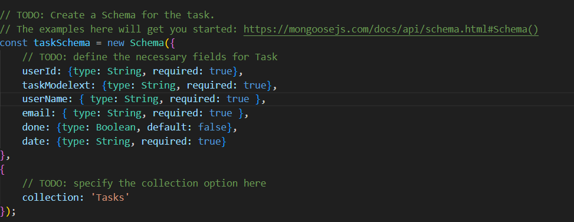
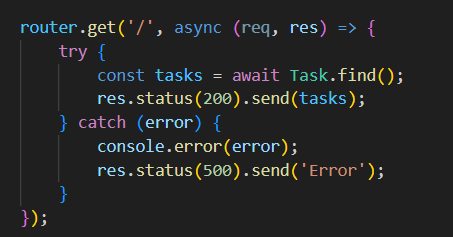
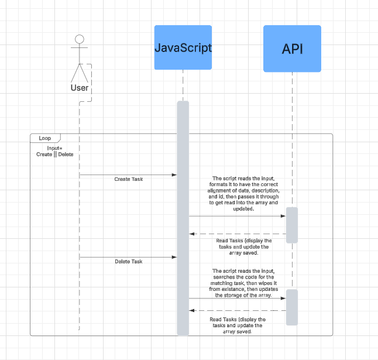

# **Lab 4 API**
## *Jackson Dubreuil*
### *Monday 24th of March, 2025*

In lab 4 I have accomplished a couple of things but the basics being completing Javascript files to connect an authenticator and create my API.  Thorough testing also allowed for this lab to give traction to proper learning and understanding of how each component works.  The API testing also allowed for local testing and then fixed changes to the server information to also change that as the needs were seen.  A proper coding environment was also created to properly manage the data.

The first part of this lab is created in the API model.  Created in the file “taskModel.js”, the taskModel holds a lot of information besides just the task model, because it is actually supposed to hold a lot of information pertaining to the user as well.  This model creates data with the information for the userID, the email, and the username of the user, while also grabbing the information needed to properly create tasks.  This is important, as will be seen in future code, as all of the creation databases and delete databases and all other information ask for the model in order to properly create and call the information.

The code here expresses one of the many tasks that the code must carry out.  There are a system of 4 codes here that are implemented to create, maintain, push, and call CRUD functions for the API model.  These .js functions, all separate, interact with one another to maintain that the API model is created properly and maintains the proper authentication and safety measures.  Here we can see the endpoints created and called so that the code can go to the correct reference without giving unneeded information to the user.

# Questions
__Name and discuss at least two of the benefits of writing unit tests before writing code.__

The benefits of writing unit tests is code clarity and redcuces the time for debugging.

__What would be some of the benefits of automating your test scripts (i.e. so they run at each commit)?__

It is very consistent and reliable, but also because allows for early bug detection

__How long did this lab take you?__

It took me about 7 hours

__List three advantages to using a web API.__

1. Separation of Frontend and Backend
2. Interoperability and Integration
3. Scalability and Reusability

__What are the differences between these four HTTP methods: GET, POST, PUT, and DELETE? Which ones are idempotent?__

- GET: Retreives data and is idempotent
- POST: Creates resources and is not idempotent
- PUT: updates and is idempotent
- DELETE: Removes a resource and is idempotent

# Lessons Learned

Problem: While testing my API, I encountered an issue where the authentication token was not being recognized, preventing users from accessing protected routes.

Cause: This happened because the token was not being included correctly in the request headers, or it had expired without a proper refresh mechanism.

Solution: I ensured that the frontend properly attached the token in the Authorization header using the wrong headers.

Problem: When making GET requests, the API would return an empty array instead of the expected task data.

Cause: The issue was due to the database query not properly filtering tasks by the correct user ID, causing the API to return no matching records.

Solution: I debugged by logging the query parameters and realized the user ID was missing. After fixing the query to correctly filter by user ID, the API returned the correct task data.

Problem: My frontend application was unable to fetch data from the API due to a Cross-Origin Resource Sharing (CORS) error.

Cause: The backend server was not configured to allow requests from the frontend domain, causing the browser to block the request for security reasons.

Solution: I updated my API’s server configuration to include appropriate CORS headers using the cors middleware in auth.js. I specified allowed origins in the settings to ensure only my frontend application could make requests while maintaining security.

# Skills Aquired

- Implement authentication using tokens to secure API endpoints.

- Create and manage a structured database model using Mongoose in a Node.js environment.

- Develop and test RESTful API endpoints following CRUD (Create, Read, Update, Delete) principles.

# References

- https://www.w3schools.com/nodejs/
- https://aws.amazon.com/what-is/api/
- https://newrelic.com/lp/products/infrastructure-wglp-api-testing?utm_medium=cpc&utm_source=google&utm_campaign=EVER-GREEN_NB_SEARCH_INFRASTRUCTURE_AMER_NORAM_EN&utm_network=g&utm_keyword=api%20testing&utm_device=c&_bt=738022277503&_bm=e&_bn=g&cq_cmp=22319979798&cq_con=181485849972&cq_plac=&l5_source=googleads&l5_cid=22319979798&l5_adid=738022277503&mkt_network=g&adgroup=api_testing&gad_source=1&gclid=Cj0KCQjwhYS_BhD2ARIsAJTMMQaO5ha9-MWSH3LkZDrPp-nRvPcGqzlaPWTiwJpDZocA7V0FtWKV0f4aAsq_EALw_wcB